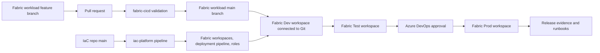

# Microsoft Fabric DataOps and DevOps Implementation Guide

## What This Scaffold Provides

This repository contains a starter implementation for modern DataOps/DevOps around Microsoft Fabric, designed to run exclusively in Azure DevOps.

The recommended operating model uses two independent Azure Repos repositories:

- Fabric workload repo: notebooks, data pipelines, semantic models, reports, and Fabric item definitions.
- Platform/IaC repo: Terraform, Azure Pipelines YAML, automation scripts, documentation, and runbooks.

The top-level folders in this reference repo map directly to those repositories:

- `iac/` becomes the platform/IaC repo.
- `fabric/` becomes the Fabric workload repo.

This scaffold provides:

- Terraform-managed Fabric workspaces, Dev workspace Git integration, Fabric deployment pipeline stages, workspace roles, baseline Lakehouses, Azure DevOps pipeline definitions, and Azure operational resources.
- One Azure Pipeline for platform/IaC changes.
- One Azure Pipeline for Fabric workload validation and Dev to Test to Prod promotion.
- Static validation for Fabric JSON artifacts, notebooks, and Spark Environment definitions.
- Operational runbooks for failed validation, failed promotion, production incidents, and access requests.

The design follows Microsoft Fabric ALM guidance: use the Fabric workload repo as the source of truth for Fabric items, connect Git only to the Dev workspace, and let the Fabric workload Azure Pipeline control promotion from Dev to Test to Prod through Fabric deployment pipelines. This scaffold is intentionally Azure DevOps-only.

## Target Architecture



## Repository Layout

Reference repo:

```text
iac/
fabric/
```

Platform/IaC repo template (`iac/`):

```text
azure-pipelines/
  iac-platform.yml
  templates/
terraform/
  versions.tf
  variables.tf
  main.tf
  outputs.tf
  terraform.tfvars.example
scripts/
  .gitkeep
tests/
runbooks/
README.md
```

Fabric workload repo template (`fabric/`):

```text
azure-pipelines/
  fabric-cicd.yml
  templates/
deployment-rules/
dataflows/
environments/
eventstreams/
items/
lakehouses/
notebooks/
pipelines/
reports/
scripts/
semantic-models/
tests/
README.md
```

Copy the contents of `iac/` to the platform/IaC Azure Repos repository and the contents of `fabric/` to the Fabric workload Azure Repos repository.

## Prerequisites

1. Microsoft Fabric tenant and capacity.
2. Azure DevOps project with two Azure Repos repositories:
   - platform/IaC repository for this scaffold
   - Fabric workload repository for notebooks, pipelines, and item definitions
3. Azure Resource Manager service connection in Azure DevOps, preferably using workload identity federation.
4. Fabric configured connection for Azure DevOps Git integration.
5. Service principal or user identity with permission to manage Fabric workspaces, Azure resources, and Azure DevOps pipeline definitions.
6. Terraform 1.7 or later.

Microsoft recommends explicitly authorizing service connections to pipelines instead of granting broad access to all pipelines.

For local Terraform runs, authenticate the Azure DevOps provider with `AZDO_ORG_SERVICE_URL` and `AZDO_PERSONAL_ACCESS_TOKEN`, or export only `AZDO_PERSONAL_ACCESS_TOKEN` when `azuredevops_org_service_url` is supplied through `terraform.tfvars`. For Azure resources and Fabric, sign in with an identity that has the required Azure RBAC and Fabric tenant/workspace permissions.

## Branching and Promotion Model

Use this default flow:

- `feature/*` or `bugfix/*`: developer work.
- Fabric workload repo `main`: approved integration branch and source of truth for Fabric content.
- Platform/IaC repo `main`: source of truth for Terraform, release orchestration, and runbooks.
- Fabric Dev workspace: connected to `main` through Fabric Git integration.
- Fabric Test workspace: not connected to Git; promoted from Dev by Azure Pipelines using an overwrite validation policy.
- Fabric Prod workspace: not connected to Git; promoted from Test by Azure Pipelines using an incremental update policy after approval.

Protect `main` in both repositories with branch policies:

- Require pull requests.
- Require successful CI.
- Require minimum reviewers.
- Limit direct pushes.
- Require linked work items for production changes.

## Configure Terraform

1. In the platform/IaC repo, copy `terraform/terraform.tfvars.example` to `terraform/terraform.tfvars`.
2. Fill in:
   - `fabric_capacity_id`
   - `fabric_git_connection_id`
   - `azuredevops_org_service_url`
   - `azuredevops_project_name`
   - `azuredevops_iac_repository_name`
   - `azuredevops_fabric_repository_name`
   - `azure_service_connection_name`
   - workspace admin and contributor group object IDs
   - production viewer group object IDs
   - deployment pipeline admin group object IDs
3. Review `dev_git_branch` and `git_directory`.
4. Run:

```bash
cd terraform
terraform init
terraform fmt -recursive
terraform validate
terraform plan -var-file terraform.tfvars
terraform apply -var-file terraform.tfvars
```

For team use, configure a remote backend before the first shared apply. Use Azure Storage with blob versioning and restricted RBAC.

When running from this reference repo before splitting the folders into separate Azure Repos repositories, use `cd iac/terraform` instead.

## Configure Azure Pipelines

Terraform creates two Azure Pipeline definitions:

- `<project>-iac-platform`, sourced from the platform/IaC repo.
- `<project>-fabric-cicd`, sourced from the Fabric workload repo.

After creation:

1. Open each pipeline in Azure DevOps.
2. Authorize the Azure Resource Manager service connection for the pipeline.
3. Create Azure DevOps Environments named `fabric-platform`, `fabric-test`, and `fabric-prod`.
4. Add approval checks to `fabric-prod`. Add checks to `fabric-test` as needed for UAT control.
5. Confirm the `vg-fabric-dataops` variable group is authorized for each pipeline.

For the first bootstrap, either run Terraform locally or create a temporary variable group containing `azureServiceConnection`. After Terraform applies successfully, it manages the shared variable group and pipeline definitions.

## CI/CD Behavior

`iac-platform` pipeline:

- Runs only on platform/IaC repo changes.
- Checks Terraform formatting and validation.
- Produces a Terraform plan.
- Applies platform changes from `main` only.
- Creates or updates Fabric workspaces, deployment pipeline stages, role assignments, variable groups, and Azure DevOps pipeline definitions.

`fabric-cicd` pipeline:

- Runs only on Fabric workload repo changes.
- Validates Fabric JSON artifacts, notebooks, YAML, and workload tests.
- Syncs only the Dev Fabric workspace from Git.
- Deploys Dev to Test through the Fabric deployment pipeline API using the `overwrite-test` policy.
- Deploys Test to Prod through the Fabric deployment pipeline API after Azure DevOps approval using the `incremental-prod` policy.
- Publishes release evidence for auditability.
- Does not run Terraform and does not alter platform/IaC resources.

## Fabric Deployment Automation

`scripts/sync_fabric_from_git.py` calls the Fabric REST API `updateFromGit` operation for the Dev workspace and writes release evidence. Test and Prod are intentionally not Git-connected.

`scripts/deploy_fabric_stage.py` calls the Fabric deployment pipeline `deploy` API for consecutive stage deployments:

- Dev to Test with `overwrite-test`
- Test to Prod with `incremental-prod`

The Fabric deployment API deploys all supported source-stage items when no item list is specified. Existing paired target items are updated, and new supported source items are created in the target. This automation does not delete target-only items.

Environment policy:

- Dev: align with the Fabric workload repo `main` branch through Git sync.
- Test: overwrite/update from Dev and create new items from Dev. Test is a validation target and should not contain manually maintained content.
- Prod: incremental update from Test. Existing paired Prod items are updated, new approved items are created, and target-only Prod items remain until manually deleted through a separate approved retirement/change process.

Terraform adds these values to the Azure DevOps variable group:

- `FABRIC_WORKSPACE_ID_DEV`
- `FABRIC_WORKSPACE_ID_TEST`
- `FABRIC_WORKSPACE_ID_PROD`
- `FABRIC_DEPLOYMENT_PIPELINE_ID`
- `FABRIC_DEPLOYMENT_STAGE_ID_DEV`
- `FABRIC_DEPLOYMENT_STAGE_ID_TEST`
- `FABRIC_DEPLOYMENT_STAGE_ID_PROD`

The pipeline gets the Fabric access token through the Azure CLI service connection context. The service connection identity must be a deployment pipeline admin and at least a contributor on source and target workspaces. Service principal deployment is supported only when the involved Fabric item types support service principals.

## Fabric-Specific Release Considerations

Fabric item support differs by item type. Do not assume every workspace item can be deployed the same way. Before enabling a workload in production, confirm whether the item type supports Git integration, deployment pipelines, service principals, deployment rules, and REST automation.

Use these folders in the Fabric workload repo:

- `notebooks/`: notebooks and reusable notebook logic. Prefer parameters for environment-specific values.
- `environments/`: Spark Environment item definitions, including public libraries, custom libraries, Spark runtime, and Spark compute settings supported by Fabric Git integration.
- `pipelines/`: Fabric data pipelines. External connections and item references should be parameterized where possible.
- `lakehouses/`: Lakehouse definitions and metadata. Lakehouse data is not moved by Git or deployment pipeline promotion.
- `warehouses/`: Warehouse definitions and metadata. Validate deployment-pipeline support and limitations for your schema/data-change pattern.
- `dataflows/`: Dataflow definitions where supported. OAuth connectors may require manual reauthentication after deployment.
- `eventstreams/`: Eventstream definitions where supported. Validate source/sink bindings per environment.
- `items/`: generic Fabric item definitions exported from Git integration or REST APIs.
- `semantic-models/`: semantic model project files and model deployment assets.
- `reports/`: report project files.
- `deployment-rules/`: documented Dev/Test/Prod overrides such as lakehouse bindings, data source rules, notebook parameters, semantic model parameters, connection references, and refresh behavior.

Spark Environments need special handling:

- Git tracks supported Environment library and Spark compute settings.
- Git sync updates the Environment staging state. Publish the Environment before relying on it for live notebook execution.
- Fabric deployment pipelines can promote Environment items, but the feature is currently preview.
- Custom pools are not fully supported in deployment pipelines. If a custom pool is selected, target Environment compute settings can fall back to defaults and continue showing differences after deployment.
- Pin library versions where possible and keep custom library files in source control.

For Lakehouses, Microsoft documents that data is preserved during Git operations and that deployment pipelines can be used for environment segmentation. Treat Lakehouse data separately from Lakehouse definitions. Do not rely on Git or deployment pipelines to move production data.

For notebooks and data pipelines, validate these before release:

- References to Lakehouses, Warehouses, and other workspace items.
- Parameter values for Test and Prod.
- Connection identities and gateways.
- Schedules and trigger state.
- Whether activity references use logical IDs that can be rebound by Fabric deployment pipelines.

For semantic models and reports, validate these before release:

- Data source and parameter deployment rules.
- Model format compatibility.
- Report-to-model bindings.
- Refresh credentials and refresh schedules.

If an item type is not supported by Fabric deployment pipelines or has incomplete rule support for your scenario, keep the item in source control but deploy it with a workload-specific script or a manual runbook until the Fabric APIs support the required behavior.

## Testing Strategy

Recommended test layers:

- Static checks: JSON parsing, notebook structure, YAML linting, Terraform validation.
- Unit tests: reusable transformation logic and notebook helper libraries.
- Contract tests: expected schemas for source and curated tables.
- Data quality tests: null checks, uniqueness, referential integrity, accepted value sets.
- Deployment tests: confirm expected Fabric items exist after promotion.
- Smoke tests: execute representative notebooks or pipelines in test before production approval.

## Release Management

Each release should capture:

- Work item or change request.
- Source branch and commit SHA.
- Terraform plan artifact.
- Approval record.
- Dev sync evidence.
- Fabric deployment evidence.
- Prod manual deletion/retirement evidence when applicable.
- Environment-specific deployment-rule review.
- Smoke test results.
- Rollback decision and owner.

Use semantic release labels for data products where useful, for example `sales-mart-v1.4.0`.

## Security and Governance

- Use Entra ID groups for workspace access.
- Keep production access read-only except for release identities and break-glass admins.
- Store secrets in Key Vault, not pipeline YAML.
- Use workload identity federation where available.
- Keep only the Dev workspace Git-connected unless you deliberately choose a branch-per-environment model.
- Do not delete Prod items automatically as part of deployment. Retire Prod items manually with explicit approval and evidence.
- Require manual approval for production.
- Keep release evidence for audit and incident response.

## Access Management

Access should be group-based and environment-specific:

- Platform admins: Admin on all Fabric workspaces and Admin on the Fabric deployment pipeline.
- Data engineers: Contributor in Dev and Test only.
- Prod consumers: Viewer in Prod only.
- Release identity: deployment pipeline Admin and Contributor or higher on source and target workspaces.
- Break-glass admins: emergency Admin access, time-limited and reviewed after use.

Terraform manages the workspace role assignments and deployment pipeline Admin assignment where supported. The key variables are:

- `workspace_admin_principal_ids`
- `workspace_contributor_principal_ids`
- `prod_viewer_principal_ids`
- `deployment_pipeline_admin_principal_ids`

Do not use direct user assignments as the normal operating model. Add and remove users from Entra ID groups instead.

Data access is separate from workspace access. Use OneLake security roles, Warehouse/Lakehouse permissions, and semantic model permissions to control who can read data. A user can have workspace Viewer access but still need explicit data permissions depending on the item and OneLake security model.

## Policy Management

Fabric policies span several control planes:

- Tenant settings: Git integration, service principal access, external sharing, export controls, and preview feature enablement.
- Capacity settings: delegated tenant settings, disaster recovery, capacity-level governance, and workload behavior.
- Workspace settings: domain assignment, sensitivity labels, endorsement/certification, contact/ownership, and item governance.
- Data policies: OneLake security roles, shortcut governance, Lakehouse/Warehouse permissions, semantic model RLS/OLS, and connection permissions.
- Release policies: branch protection, Azure DevOps approvals, release evidence, deployment-rule review, and production retirement changes.

Not every Fabric policy currently has a stable Terraform resource. Where automation is not available, maintain the policy in `iac/policies/fabric-access-and-governance.md`, assign an owner, and validate it during platform readiness reviews.

## Operational Runbooks

Use `runbooks/fabric-operations.md` as the initial operations handbook. Add workspace-specific procedures for:

- Failed notebook runs.
- Failed Fabric pipeline activities.
- Lakehouse or Warehouse refresh failures.
- Source system outage.
- Bad data rollback.
- Emergency access.

## Microsoft References

- [CI/CD workflow options in Fabric](https://learn.microsoft.com/en-us/fabric/cicd/manage-deployment)
- [Automate Git integration by using APIs](https://learn.microsoft.com/en-us/fabric/cicd/git-integration/git-automation)
- [Automate deployment pipelines by using Fabric APIs](https://learn.microsoft.com/en-us/fabric/cicd/deployment-pipelines/pipeline-automation-fabric)
- [CI/CD for pipelines in Data Factory](https://learn.microsoft.com/en-us/fabric/data-factory/cicd-pipelines)
- [Azure Pipelines service connections](https://learn.microsoft.com/en-us/azure/devops/pipelines/library/service-endpoints)
- [Microsoft Fabric Terraform provider workspace resource](https://registry.terraform.io/providers/microsoft/fabric/latest/docs/resources/workspace)
- [Microsoft Fabric Terraform provider workspace Git resource](https://registry.terraform.io/providers/microsoft/fabric/latest/docs/resources/workspace_git)
- [Microsoft Fabric Terraform provider deployment pipeline resource](https://registry.terraform.io/providers/microsoft/fabric/latest/docs/resources/deployment_pipeline)
