# Microsoft Fabric DataOps and DevOps Implementation Guide

## What This Scaffold Provides

This repository contains a starter implementation for modern DataOps/DevOps around Microsoft Fabric, designed to run exclusively in Azure DevOps.

The recommended operating model uses two Azure Repos repositories:

- Fabric workload repo: notebooks, data pipelines, semantic models, reports, and Fabric item definitions.
- Platform/IaC repo: Terraform, Azure Pipelines YAML, automation scripts, documentation, and runbooks.

This scaffold provides:

- Terraform-managed Fabric workspaces, Dev workspace Git integration, Fabric deployment pipeline stages, workspace roles, baseline Lakehouses, and Azure operational resources.
- Azure Pipelines for CI validation, Terraform planning/apply, environment promotion, release evidence, and approvals.
- Static validation for Fabric JSON artifacts and notebooks.
- Operational runbooks for failed validation, failed promotion, production incidents, and access requests.

The design follows Microsoft Fabric ALM guidance: use the Fabric workload repo as the source of truth for Fabric items, connect Git only to the Dev workspace, and let Azure Pipelines in the platform/IaC repo control promotion from Dev to Test to Prod through Fabric deployment pipelines. This scaffold is intentionally Azure DevOps-only.

## Target Architecture

```mermaid
flowchart LR
  Dev["Fabric workload feature branch"] --> PR["Pull request"]
  PR --> CI["CI pipeline: lint, tests, Terraform plan"]
  CI --> Main["Fabric workload main branch"]
  Main --> DevWS["Fabric Dev workspace connected to Git"]
  DevWS --> TestWS["Fabric Test workspace"]
  TestWS --> Approval["Azure DevOps approval"]
  Approval --> ProdWS["Fabric Prod workspace"]
  ProdWS --> Evidence["Release evidence and runbooks"]
```



## Repository Layout

Platform/IaC repo:

```text
azure-pipelines/
  ci.yml
  release.yml
  templates/
terraform/
  versions.tf
  variables.tf
  main.tf
  outputs.tf
  terraform.tfvars.example
scripts/
  validate_fabric_items.py
  sync_fabric_from_git.py
  deploy_fabric_stage.py
tests/
runbooks/
IMPLEMENTATION_GUIDE.md
```

Fabric workload repo:

```text
fabric/
notebooks/
pipelines/
```

The workload repo name defaults to `fabric-workloads` in the YAML repository resources. If you use another name, update `azure-pipelines/ci.yml` and `azure-pipelines/release.yml`.

## Prerequisites

1. Microsoft Fabric tenant and capacity.
2. Azure DevOps project with two Azure Repos repositories:
   - platform/IaC repository for this scaffold
   - Fabric workload repository for notebooks, pipelines, and item definitions
3. Azure Resource Manager service connection in Azure DevOps, preferably using workload identity federation.
4. Fabric configured connection for Azure DevOps Git integration.
5. Service principal or user identity with permission to manage Fabric workspaces, Azure resources, and Azure DevOps pipeline definitions.
6. Terraform 1.7 or later.

Microsoft recommends explicitly authorizing service connections to pipelines instead of granting broad access to all pipelines.

For local Terraform runs, authenticate the Azure DevOps provider with `AZDO_ORG_SERVICE_URL` and `AZDO_PERSONAL_ACCESS_TOKEN`, or export only `AZDO_PERSONAL_ACCESS_TOKEN` when `azuredevops_org_service_url` is supplied through `terraform.tfvars`. For Azure resources and Fabric, sign in with an identity that has the required Azure RBAC and Fabric tenant/workspace permissions.

## Branching and Promotion Model

Use this default flow:

- `feature/*` or `bugfix/*`: developer work.
- Fabric workload repo `main`: approved integration branch and source of truth for Fabric content.
- Platform/IaC repo `main`: source of truth for Terraform, release orchestration, and runbooks.
- Fabric Dev workspace: connected to `main` through Fabric Git integration.
- Fabric Test workspace: not connected to Git; promoted from Dev by Azure Pipelines.
- Fabric Prod workspace: not connected to Git; promoted from Test by Azure Pipelines after approval.

Protect `main` in both repositories with branch policies:

- Require pull requests.
- Require successful CI.
- Require minimum reviewers.
- Limit direct pushes.
- Require linked work items for production changes.

## Configure Terraform

1. Copy `terraform/terraform.tfvars.example` to `terraform/terraform.tfvars`.
2. Fill in:
   - `fabric_capacity_id`
   - `fabric_git_connection_id`
   - `azuredevops_org_service_url`
   - `azuredevops_project_name`
   - `azuredevops_iac_repository_name`
   - `azuredevops_fabric_repository_name`
   - `azure_service_connection_name`
   - workspace admin and contributor group object IDs
   - deployment pipeline admin group object IDs
3. Review `dev_git_branch` and `git_directory`.
4. Run:

```bash
cd terraform
terraform init
terraform fmt -recursive
terraform validate
terraform plan -var-file terraform.tfvars
terraform apply -var-file terraform.tfvars
```

For team use, configure a remote backend before the first shared apply. Use Azure Storage with blob versioning and restricted RBAC.

## Configure Azure Pipelines

Terraform creates two pipeline definitions:

- `<project>-fabric-ci`
- `<project>-fabric-release`

After creation:

1. Open each pipeline in Azure DevOps.
2. Authorize the Azure Resource Manager service connection for the pipeline.
3. Create Azure DevOps Environments named `fabric-platform`, `fabric-test`, and `fabric-prod`.
4. Add approval checks to `fabric-prod`. Add checks to `fabric-test` as needed for UAT control.
5. Confirm the `vg-fabric-dataops` variable group is authorized for each pipeline.
6. If your Fabric workload repository is not named `fabric-workloads`, update the `resources.repositories.name` value in `azure-pipelines/ci.yml` and `azure-pipelines/release.yml`.

## CI/CD Behavior

CI pipeline:

- Runs on platform/IaC repo changes.
- Also watches the Fabric workload repo for changes to `main`, `develop`, `feature/*`, and `bugfix/*`.
- Checks Terraform formatting and validation.
- Produces a Terraform plan.
- Runs JSON and notebook validation against the Fabric workload repo.
- Runs YAML and pytest validation against the platform/IaC repo.

Release pipeline:

- Runs on platform/IaC repo `main` changes.
- Also runs when the Fabric workload repo `main` changes.
- Plans and applies platform infrastructure.
- Syncs only the Dev Fabric workspace from Git.
- Deploys Dev to Test through the Fabric deployment pipeline API.
- Deploys Test to Prod through the Fabric deployment pipeline API after Azure DevOps approval.
- Publishes release evidence for auditability.
- Uses Azure DevOps environment approvals for production.

## Fabric Deployment Automation

`scripts/sync_fabric_from_git.py` calls the Fabric REST API `updateFromGit` operation for the Dev workspace and writes release evidence. Test and Prod are intentionally not Git-connected.

`scripts/deploy_fabric_stage.py` calls the Fabric deployment pipeline `deploy` API for consecutive stage deployments:

- Dev to Test
- Test to Prod

Terraform adds these values to the Azure DevOps variable group:

- `FABRIC_WORKSPACE_ID_DEV`
- `FABRIC_WORKSPACE_ID_TEST`
- `FABRIC_WORKSPACE_ID_PROD`
- `FABRIC_DEPLOYMENT_PIPELINE_ID`
- `FABRIC_DEPLOYMENT_STAGE_ID_DEV`
- `FABRIC_DEPLOYMENT_STAGE_ID_TEST`
- `FABRIC_DEPLOYMENT_STAGE_ID_PROD`

The pipeline gets the Fabric access token through the Azure CLI service connection context. The service connection identity must be a deployment pipeline admin and at least a contributor on source and target workspaces. Service principal deployment is supported only when the involved Fabric item types support service principals.

## Testing Strategy

Recommended test layers:

- Static checks: JSON parsing, notebook structure, YAML linting, Terraform validation.
- Unit tests: reusable transformation logic and notebook helper libraries.
- Contract tests: expected schemas for source and curated tables.
- Data quality tests: null checks, uniqueness, referential integrity, accepted value sets.
- Deployment tests: confirm expected Fabric items exist after promotion.
- Smoke tests: execute representative notebooks or pipelines in test before production approval.

## Release Management

Each release should capture:

- Work item or change request.
- Source branch and commit SHA.
- Terraform plan artifact.
- Approval record.
- Dev sync evidence.
- Fabric deployment evidence.
- Smoke test results.
- Rollback decision and owner.

Use semantic release labels for data products where useful, for example `sales-mart-v1.4.0`.

## Security and Governance

- Use Entra ID groups for workspace access.
- Keep production access read-only except for release identities and break-glass admins.
- Store secrets in Key Vault, not pipeline YAML.
- Use workload identity federation where available.
- Keep only the Dev workspace Git-connected unless you deliberately choose a branch-per-environment model.
- Require manual approval for production.
- Keep release evidence for audit and incident response.

## Operational Runbooks

Use `runbooks/fabric-operations.md` as the initial operations handbook. Add workspace-specific procedures for:

- Failed notebook runs.
- Failed Fabric pipeline activities.
- Lakehouse or Warehouse refresh failures.
- Source system outage.
- Bad data rollback.
- Emergency access.

## Microsoft References

- [CI/CD workflow options in Fabric](https://learn.microsoft.com/en-us/fabric/cicd/manage-deployment)
- [Automate Git integration by using APIs](https://learn.microsoft.com/en-us/fabric/cicd/git-integration/git-automation)
- [Automate deployment pipelines by using Fabric APIs](https://learn.microsoft.com/en-us/fabric/cicd/deployment-pipelines/pipeline-automation-fabric)
- [CI/CD for pipelines in Data Factory](https://learn.microsoft.com/en-us/fabric/data-factory/cicd-pipelines)
- [Azure Pipelines service connections](https://learn.microsoft.com/en-us/azure/devops/pipelines/library/service-endpoints)
- [Microsoft Fabric Terraform provider workspace resource](https://registry.terraform.io/providers/microsoft/fabric/latest/docs/resources/workspace)
- [Microsoft Fabric Terraform provider workspace Git resource](https://registry.terraform.io/providers/microsoft/fabric/latest/docs/resources/workspace_git)
- [Microsoft Fabric Terraform provider deployment pipeline resource](https://registry.terraform.io/providers/microsoft/fabric/latest/docs/resources/deployment_pipeline)
