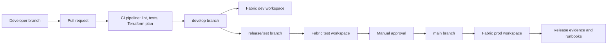

# Microsoft Fabric DataOps and DevOps Implementation Guide

## What This Scaffold Provides

This repository contains a starter implementation for modern DataOps/DevOps around Microsoft Fabric, designed to run exclusively in Azure DevOps.

- Terraform-managed Fabric workspaces, Git connections, workspace roles, baseline Lakehouses, and Azure operational resources.
- Azure Pipelines for CI validation, Terraform planning/apply, environment promotion, release evidence, and approvals.
- Static validation for Fabric JSON artifacts and notebooks.
- Operational runbooks for failed validation, failed promotion, production incidents, and access requests.

The design follows Microsoft Fabric ALM guidance: use Azure DevOps Repos as the source of truth, automate workspace Git integration, and use Azure Pipelines for controlled promotion. Microsoft documents that Fabric Git integration APIs support CI/CD automation, including connecting workspaces to Git and syncing content. This scaffold is intentionally Azure DevOps-only.

## Target Architecture



## Repository Layout

```text
azure-pipelines/
  ci.yml
  release.yml
  templates/
terraform/
  versions.tf
  variables.tf
  main.tf
  outputs.tf
  terraform.tfvars.example
scripts/
  validate_fabric_items.py
  sync_fabric_from_git.py
tests/
runbooks/
IMPLEMENTATION_GUIDE.md
```

## Prerequisites

1. Microsoft Fabric tenant and capacity.
2. Azure DevOps project and Azure Repos repository.
3. Azure Resource Manager service connection in Azure DevOps, preferably using workload identity federation.
4. Fabric configured connection for Azure DevOps Git integration.
5. Service principal or user identity with permission to manage Fabric workspaces, Azure resources, and Azure DevOps pipeline definitions.
6. Terraform 1.7 or later.

Microsoft recommends explicitly authorizing service connections to pipelines instead of granting broad access to all pipelines.

For local Terraform runs, authenticate the Azure DevOps provider with `AZDO_ORG_SERVICE_URL` and `AZDO_PERSONAL_ACCESS_TOKEN`, or export only `AZDO_PERSONAL_ACCESS_TOKEN` when `azuredevops_org_service_url` is supplied through `terraform.tfvars`. For Azure resources and Fabric, sign in with an identity that has the required Azure RBAC and Fabric tenant/workspace permissions.

## Branching and Promotion Model

Use this default flow:

- `feature/*` or `bugfix/*`: developer work.
- `develop`: integration branch, mapped to the Fabric dev workspace.
- `release/test`: controlled test branch, mapped to the Fabric test workspace.
- `main`: production branch, mapped to the Fabric prod workspace.

Protect `develop`, `release/test`, and `main` with branch policies:

- Require pull requests.
- Require successful CI.
- Require minimum reviewers.
- Limit direct pushes.
- Require linked work items for production changes.

## Configure Terraform

1. Copy `terraform/terraform.tfvars.example` to `terraform/terraform.tfvars`.
2. Fill in:
   - `fabric_capacity_id`
   - `fabric_git_connection_id`
   - `azuredevops_org_service_url`
   - `azuredevops_project_name`
   - `azuredevops_repository_name`
   - `azure_service_connection_name`
   - workspace admin and contributor group object IDs
3. Review `branch_by_environment` and `git_directory`.
4. Run:

```bash
cd terraform
terraform init
terraform fmt -recursive
terraform validate
terraform plan -var-file terraform.tfvars
terraform apply -var-file terraform.tfvars
```

For team use, configure a remote backend before the first shared apply. Use Azure Storage with blob versioning and restricted RBAC.

## Configure Azure Pipelines

Terraform creates two pipeline definitions:

- `<project>-fabric-ci`
- `<project>-fabric-release`

After creation:

1. Open each pipeline in Azure DevOps.
2. Authorize the Azure Resource Manager service connection for the pipeline.
3. Create Azure DevOps Environments named `fabric-test` and `fabric-prod`.
4. Add approval checks to `fabric-prod`.
5. Confirm the `vg-fabric-dataops` variable group is authorized for each pipeline.

## CI/CD Behavior

CI pipeline:

- Runs on pull requests and feature/develop changes.
- Checks Terraform formatting and validation.
- Produces a Terraform plan.
- Runs JSON, notebook, YAML, and pytest validation.

Release pipeline:

- Runs on `main` and `release/*`.
- Plans and applies infrastructure.
- Syncs the target Fabric workspace from Git.
- Publishes release evidence for auditability.
- Uses Azure DevOps environment approvals for production.

## Fabric Sync Script

`scripts/sync_fabric_from_git.py` calls the Fabric REST API `updateFromGit` operation and writes release evidence. Terraform adds `FABRIC_WORKSPACE_ID_DEV`, `FABRIC_WORKSPACE_ID_TEST`, and `FABRIC_WORKSPACE_ID_PROD` to the Azure DevOps variable group. The pipeline gets the Fabric access token through the Azure CLI service connection context. The service connection identity must have contributor or higher access to the target Fabric workspace and must be supported by every Fabric item type being promoted.

## Testing Strategy

Recommended test layers:

- Static checks: JSON parsing, notebook structure, YAML linting, Terraform validation.
- Unit tests: reusable transformation logic and notebook helper libraries.
- Contract tests: expected schemas for source and curated tables.
- Data quality tests: null checks, uniqueness, referential integrity, accepted value sets.
- Deployment tests: confirm expected Fabric items exist after promotion.
- Smoke tests: execute representative notebooks or pipelines in test before production approval.

## Release Management

Each release should capture:

- Work item or change request.
- Source branch and commit SHA.
- Terraform plan artifact.
- Approval record.
- Fabric sync evidence.
- Smoke test results.
- Rollback decision and owner.

Use semantic release labels for data products where useful, for example `sales-mart-v1.4.0`.

## Security and Governance

- Use Entra ID groups for workspace access.
- Keep production access read-only except for release identities and break-glass admins.
- Store secrets in Key Vault, not pipeline YAML.
- Use workload identity federation where available.
- Keep Fabric workspace Git connections configured centrally.
- Require manual approval for production.
- Keep release evidence for audit and incident response.

## Operational Runbooks

Use `runbooks/fabric-operations.md` as the initial operations handbook. Add workspace-specific procedures for:

- Failed notebook runs.
- Failed Fabric pipeline activities.
- Lakehouse or Warehouse refresh failures.
- Source system outage.
- Bad data rollback.
- Emergency access.

## Microsoft References

- [CI/CD workflow options in Fabric](https://learn.microsoft.com/en-us/fabric/cicd/manage-deployment)
- [Automate Git integration by using APIs](https://learn.microsoft.com/en-us/fabric/cicd/git-integration/git-automation)
- [CI/CD for pipelines in Data Factory](https://learn.microsoft.com/en-us/fabric/data-factory/cicd-pipelines)
- [Azure Pipelines service connections](https://learn.microsoft.com/en-us/azure/devops/pipelines/library/service-endpoints)
- [Microsoft Fabric Terraform provider workspace resource](https://registry.terraform.io/providers/microsoft/fabric/latest/docs/resources/workspace)
- [Microsoft Fabric Terraform provider workspace Git resource](https://registry.terraform.io/providers/microsoft/fabric/latest/docs/resources/workspace_git)
